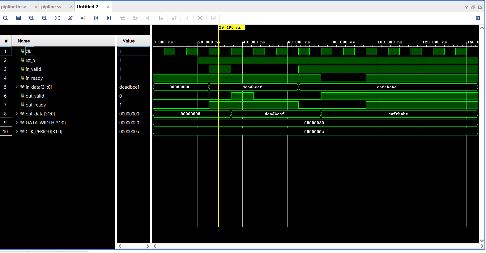

# Single-Stage Pipeline Register with Valid/Ready Handshake

A synthesizable SystemVerilog implementation of a single-stage pipeline register using standard valid/ready handshake protocol.

**Developed and tested using Xilinx Vivado 2023.2**

## Quick Start

This repository contains:
- `rtl/pipeline_register.sv` - Main RTL implementation
- `tb/tb_pipeline_register.sv` - Functional testbench
- `simulation_waveform.png` - Vivado 2023.2 verification results
- Fully synthesizable design verified on Vivado 2023.2

## Overview

This module implements a pipeline stage that sits between input and output interfaces, storing data and managing flow control through backpressure handling. The design ensures no data loss or duplication while supporting full throughput when both sides are ready.


### Parameters

| Parameter | Type | Default | Description |
|-----------|------|---------|-------------|
| DATA_WIDTH | int | 32 | Width of data bus in bits |

### Ports

| Port | Direction | Width | Description |
|------|-----------|-------|-------------|
| clk | input | 1 | Clock signal |
| rst_n | input | 1 | Active-low asynchronous reset |
| in_valid | input | 1 | Input data is valid |
| in_ready | output | 1 | Ready to accept input data |
| in_data | input | DATA_WIDTH | Input data |
| out_valid | output | 1 | Output data is valid |
| out_ready | input | 1 | Downstream ready to accept |
| out_data | output | DATA_WIDTH | Output data |


### Key Logic

**Ready Logic:**
```systemverilog
assign in_ready = ~valid_reg || output_transfer;
```
The pipeline can accept new data when:
1. It's empty (!valid_reg), OR
2. Current data is being read this cycle (output_transfer)

**Transfer Detection:**
```systemverilog
wire input_transfer  = in_valid && in_ready;
wire output_transfer = out_valid && out_ready;
```

## Simulation and Verification

### Testbench Coverage

The provided testbench (`tb/tb_pipeline_register.sv`) validates:

1. **Basic Transfer**: Single data item through pipeline
2. **Sequential Transfers**: Multiple back-to-back transfers
3. **Backpressure**: Output not ready, data held correctly
4. **Reset Behavior**: Proper initialization

### Simulation Waveform (Vivado 2023.2)



The waveform demonstrates:
- **Basic Transfer** (~20-40ns): `in_data = 0xDEADBEEF` is accepted when `in_valid` and `in_ready` are both high, then appears on `out_data` in the next cycle
- **Backpressure Handling** (~60-100ns): `in_data = 0xCAFEBABE` is accepted but output is held when `out_ready = 0`, demonstrating proper data retention during backpressure
- **Correct Handshaking**: `in_ready` goes low when the pipeline is full and `out_ready` is not asserted, preventing data loss


## Tools and Environment

- **FPGA Design Suite**: Xilinx Vivado 2023.2
- **Language**: SystemVerilog (IEEE 1800-2017)
- **Simulation**: Vivado Simulator


